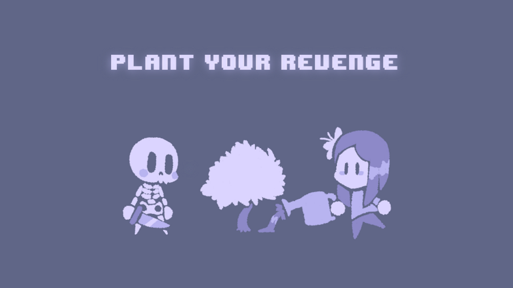

# PLANT YOUR REVENGE

- A short tower defense inspired puzzle game where you help the enemies win.
- Made in 2 days, using [this asset pack](https://www.kenney.nl/assets/monochrome-rpg) for the visuals.
- Made in [Godot 3](https://godotengine.org/download/3.x).

## WARNING:
When I tested the game again, the pathfinding of the enemies was different; luckily, all the puzzles were still solvable.
I think the enemies will behave differently depending on what version of [Godot 3](https://godotengine.org/download/3.x) you are using.